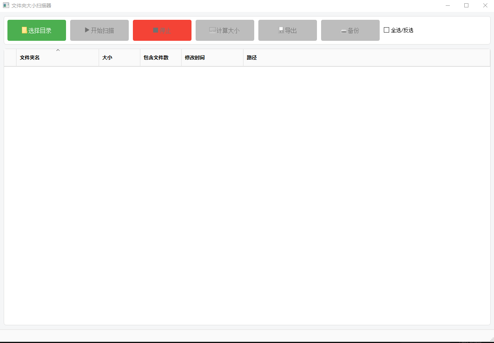

# 文件夹大小扫描器 (File Scanner)

一个基于PyQt5的文件夹大小扫描工具，可以快速扫描指定目录的文件大小，支持多种导出格式。

## 功能特性

- 📁 文件夹大小扫描
- 📊 实时进度显示
- 💾 多种导出格式 (Excel, JSON)
- 🎨 现代化UI界面
- ⚡ 多线程扫描，不阻塞界面
- 🔄 自动保存功能
- 📈 详细统计信息

## 界面预览



## 系统要求

- Windows 10/11
- Python 3.7+ (如果从源码运行)

## 安装使用

### 方式1：直接运行可执行文件
1. 下载最新版本的 `FileScanner.exe`
2. 双击运行即可

### 方式2：从源码运行
1. 克隆仓库
```bash
git clone https://github.com/yourusername/FileScannerApp.git
cd FileScannerApp
```

2. 安装依赖
```bash
pip install -r requirements.txt
```

3. 运行程序
```bash
python app.py
```

## 使用说明

1. 点击"选择文件夹"按钮选择要扫描的目录
2. 点击"开始扫描"按钮开始扫描
3. 扫描过程中可以随时点击"停止扫描"按钮停止
4. 扫描完成后可以点击"导出"按钮导出结果
5. 支持导出为Excel或JSON格式

## 项目结构

```
FileScannerApp/
├── app.py                 # 主程序入口
├── models/                # 数据模型
├── views/                 # 界面视图
├── viewmodels/           # 视图模型
├── services/             # 业务服务
├── workers/              # 工作线程
├── utils/                # 工具类
├── resources/            # 资源文件
│   ├── icons/           # 图标文件
│   └── styles/          # 样式文件
└── requirements.txt      # 依赖列表
```

## 技术栈

- **界面框架**: PyQt5
- **数据处理**: pandas
- **Excel支持**: openpyxl
- **系统信息**: psutil

## 开发说明

### 构建可执行文件
```bash
pyinstaller app.spec
```

### 日志文件
程序运行日志保存在 `logs/` 目录下

### 配置文件
用户配置保存在 `config.json` 文件中

## 版本历史

### v1.0.0
- 初始版本发布
- 基础文件夹扫描功能
- Excel和JSON导出支持
- 现代化UI界面

## 许可证

MIT License


## 联系方式

如有问题或建议，请通过GitHub Issues联系。
